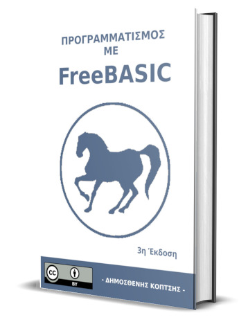

# [Προγραμματισμός με FreeBASIC](https://freebasicbook.wordpress.com/)

το Ελληνικό βιβλίο

# Καλώς ήρθατε στο βιβλίο της FreeBASIC

Το πρώτο Ελληνικό βιβλίο που σας μαθαίνει προγραμματισμό με την γλώσσα FreeBASIC

Δωρεάν ebook pdf

[Προγραμματισμός με FreeBASIC pdf download](https://github.com/demosthenesk/Programming-with-FreeBASIC-Book-GR/blob/master/%CE%A0%CF%81%CE%BF%CE%B3%CF%81%CE%B1%CE%BC%CE%BC%CE%B1%CF%84%CE%B9%CF%83%CE%BC%CF%8C%CF%82%20%CE%BC%CE%B5%20FreeBASIC%20-%203rd%20Edition%20%5Bebook%5D.pdf)

Εάν θέλετε ένα τυπωμένο αντίγραφο της 1ης έκδοσης μπορείτε να το αγοράσετε από το [Lulu](https://www.lulu.com/en/us/shop/%CE%B4%CE%B7%CE%BC%CE%BF%CF%83%CE%B8%CE%B5%CE%BD%CE%B7%CF%82-%CE%BA%CE%BF%CF%80%CF%84%CF%83%CE%B7%CF%82/%CF%80%CF%81%CE%BF%CE%B3%CF%81%CE%B1%CE%BC%CE%BC%CE%B1%CF%84%CE%B9%CF%83%CE%BC%CF%8C%CF%82-%CE%BC%CE%B5-freebasic/paperback/product-68rry8.html?page=1&pageSize=4)

Οι εκδόσεις 2η και 3η δεν διατίθενται σε τυπωμένη μορφή.

Εάν επιθυμείτε να μάθετε περισσότερα δείτε το https://www.freebasic.net/

Το pdf και το τυπωμένο βιβλίο είναι υπό άδεια [Creative Commons Αναφορά 4.0 — CC BY 4.0](https://creativecommons.org/licenses/by/4.0/legalcode.el)

